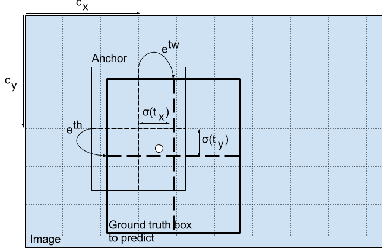
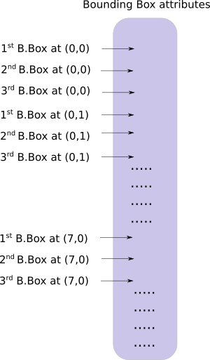

### YOLOV3


- Resunit 借助于Resnet网络中的残差结构为了使用网络训练的更深

- CBL结构 conv+BN+leaky relu函数

- 整体采用的FPN同SSD300的思路一致，小尺寸的feature map的感受野较大 用于检测较大的物体

- concat 对应的size相同，在channel所在维度上进行concat

- add 同 shortcut一致，channels数相同，H,w对应数值相加

  backbone网络的整体结构是Darknet-53,带有对应的全连接图

  


##### 预测公式

$$
b_x=\sigma(t_x)+c_x
$$

$$
b_y=\sigma(t_y)+c_y
$$

$$
b_w=p_we^{t_w}
$$

$$
b_h=p_he^{t_h}
$$

上述左面的表达式代表着对应的预测的高宽，和中心点对应的x，y左边，t_x,t_y,w_w,t_h是网c_x和c_y是网格对应的左上角的坐标，对应的pw,ph为对应的anchor的高宽 ,$\sigma $​是对应的激活函数sigmoid

##### Center coordinates

sigmoid函数强制中心坐标的值介于对应0-1之间

- yolo预测的offset是相对值坐标，即当前grid的左上角的方面
- 对应的feature map中的维度归一化

上述doge的图像位于（6.6）sigmoid输出的限制在0-1之间，如果预测的 x,y 坐标大于 1，例如 (1.2, 0.7)，会发生什么。这意味着中心位于 (7.2, 6.7)。请注意，中心现在位于我们红色单元格右侧的单元格中，或第 7 行中的第 8 个单元格。**这打破了 YOLO 背后的理论，**因为如果我们假设红框负责预测狗，那么狗的中心必须位于红细胞中，而不是旁边的那个



SSD和Faster RCNN中的理论大概一致，都是通过高宽和平移的变化，平移和缩放两个主要的步骤来完成的，SSD中$l_x$为对应prior_box的特征向量，对应的网络权重直接变换的，在高宽缩放上yolo系列大致与两个经典的网络一致，中心坐标的平移则是缺少对应的先验框的高宽长度，仅依赖于求出$\sigma$的线性变化来进行regression操作


产生的预测*bw*和*bh*由图像的高度和宽度归一化。（训练标签是这样选择的）。因此，如果包含狗的盒子的预测*bx*和*by*是 (0.3, 0.8)，那么 13 x 13 特征图上的实际宽度和高度是 (13 x 0.3, 13 x 0.8)。

##### Object score

判断当前grid是否存在物体的概率，对于狗狗所在的grid和相邻的狗日的该值为1，图像的其他区域也为对应的0，这也是一个二分类的问题，所以对应的函数也为sigmoid

##### class score

类别得分，在yolov3中，作者选用sigmoid代替，softmax默认各个类之间是互相排斥的

但是如果存在女人和人等等两个类别，对应的假设就不太可能成立，这就是避免使用softmax的reason

##### 多尺度判别

会搞这张network上，分别选择三个scale上进行prediction，由于feature map的size大小，根据FPN中的思想，金字塔的顶端的单个像素的receptive field会更大，所以可以检测较大的物体，同理较低的网络能够捕捉更小的object。

yolo V3在三个不同的尺度上进行预测。检测图利用三种不同大小的feature map进行对应的detection


每个feature map中单个pixel产生对应的anchor的数量为3个

- feature map1 (52$\times$​52) stride=8
- feature map2(26$\times $​26)  stride=16
- feature map3 13\*13    stride=32

所以网络中产生的anchor的总数对应为10647个anchors

每个scale上，每个grid利用三个anchor预测3个对应bounding box进行对应的regression操作使得anchor的数量为9个。

将网络先前层的特征图，进行对应的上采样，然后在channel所在的维度上进行对应的concat操作，来获取向前层更多的语义信息，然后添加若干层去处理这个组合的特征图。总共应用到两个上采样层，在第三个scale维度特征图处理结束后，预测网路中已经融合网络早期的细粒度特征。

先验框的ratio根据之前版本的yolo系列，进行k-means的聚类的方法，3个scale的prior box分别为(10×13),(16×30),(33×23),(30×61),(62×45),(59× 119),(116 × 90),(156 × 198),(373 × 326).

###### 	筛选方法

​	记录所在box的特征向量的object score通过阈值筛选掉一部分的anchor

​	NMS 方法，同样也是设定阈值，IOU的过高的anchor直接筛选掉



### 网络实现

##### 解析对应的cfg文件

```python
[net]
# Testing
batch=1
subdivisions=1
# Training
# batch=64
# subdivisions=16
width= 320
height = 320
channels=3
momentum=0.9
decay=0.0005
angle=0
saturation = 1.5
exposure = 1.5
hue=.1
learning_rate=0.001
burn_in=1000
max_batches = 500200
policy=steps
steps=400000,450000
scales=.1,.1
[convolutional]
batch_normalize=1
filters=32
size=3
stride=1
pad=1
activation=leaky
# Downsample
[convolutional]
batch_normalize=1
filters=64
size=3
stride=2
pad=1
activation=leaky
[route]
layers = -4

[route]
layers = -1, 61

```

yolov3中的配置文件如上述，大体可以分为五个层

- CBL 
- short cut
- upsample 利用双线性采样的因子对于前一层的feature map进行对应的处理
- route layers route仅有对应的一个值是，输出该索引值的特征图，-4代表着从该Route层向前输出第四个的特征图，route的value如果存在两个的话则是上面提出的concat的操作,沿深度方向上进行操作

```python
[yolo]
mask = 0,1,2
anchors = 10,13,  16,30,  33,23,  30,61,  62,45,  59,119,  116,90,  156,198,  373,326
classes=80
num=9
jitter=.3
ignore_thresh = .5
truth_thresh = 1
random=1
```

anchors描述了9个anchor，利用mask标签作为索引，因为一个pixel上只有对应的3个anchor，然后三个scale所以说总共有9个anchors

```python
def parse_cfg(cfgfile):
    """
    Takes a configuration file
    
    Returns a list of blocks. Each blocks describes a block in the neural
    network to be built. Block is represented as a dictionary in the list
    
    """
    block = {}
	blocks = []

for line in lines:
    if line[0] == "[":               # This marks the start of a new block
        if len(block) != 0:          # If block is not empty, implies it is storing values of previous block.
            blocks.append(block)     # add it the blocks list
            block = {}               # re-init the block
        block["type"] = line[1:-1].rstrip()  #生成对应的type，
    else:
        key,value = line.split("=") 
        block[key.rstrip()] = value.lstrip()
blocks.append(block)

return blocks
```


```python
[net]
# Testing
batch=1
subdivisions=1
# Training
# batch=64
# subdivisions=16
width= 320
height = 320
channels=3
momentum=0.9
decay=0.0005
angle=0
saturation = 1.5
exposure = 1.5
hue=.1
```

#### forward

在前面的多尺度判别中，我们得到三种不同的scale的feature map，根据k-means中，在对应的feature map中，单个grid分配了三种anchor，对应的采样倍数也同样获得，让我们重新思考下，单个特征图输出的channels(1+4+80)*3获得所需要的channels的数量，85、*3=255个对应的channels

我们将特征图reshape为(B,C,H,W)reshape成对应的下面的维度，简单来说就是将三维的tensor->转换到对应的2

最后输出的(B,H\*W\*num_anchors,bbox_attrs),下面是维度转换具体的方式

(batch_size,box_attrs*num_anchors,grid_size,grid_size)

(batch_size,gridsize\*gridsize,bbox_attrs\*num_anchors)

(batch_size,gridsize*gridsize\*num_anchors,bbox_attrs)

#### decode

正如之前提到的公式，按照知乎大佬的输出,在第二个特征图中(5,4,2)代表的意思是，第二个特征图中的cy=5,cx=4,mask=2,59,119作为anchor的w和h，计算之后的b_x要乘上对应的下采样率，得到对应的真实框的x,y


回到网络主体中，由于anchor由size是相当于对应的原始图像，所以在前向传播过程中也需要将size进行下采样

接下来是激活函数，需要对prediction cx cy objectscore 进行sigmoid处理，具体

#### 代码实现

 ```python
 def predict_transform(prediction,inp_dim,anchorsm,num_classes)
 """
 input:
 	prediction (batch,255,grid,grid)
 	inp_dim inputQ_figure shape(3,412,412)
 	anchors shape(3,2) current feature map shape
 	num_classes CoCo default classes=80
 output:
 	prediction
 """
 	batch_size = prediction.size(0)#当前的batch_size
     stride =  inp_dim // prediction.size(2)#size(2)为当前特征图的size
     grid_size = inp_dim // stride#获取对应的grid size
     bbox_attrs = 5 + num_classes#channels 80+1+4
     num_anchors = len(anchors)#shape(batch,grid*grid,2)
     prediction = prediction.view(batch_size, bbox_attrs*num_anchors, grid_size*grid_size)
     prediction = prediction.transpose(1,2).contiguous()
     prediction = prediction.view(batch_size, grid_size*grid_size*num_anchors, bbox_attrs)
     anchors = [(a[0]/stride, a[1]/stride) for a in anchors]#anchors downsample 进行对应下采样
     prediction[:,:,0] = torch.sigmoid(prediction[:,:,0])# cx
     prediction[:,:,1] = torch.sigmoid(prediction[:,:,1])# cy
     prediction[:,:,4] = torch.sigmoid(prediction[:,:,4])# object score grid的置信度
     
     
 ```

##### decode 部分(regression)

下面具体描述下上述的操作

```python
grid=np.arange(grid_size)
a,b=np.meshgrid(grad,grid)#default mode “xy" a,b shape(grid_size,grid_size)
#a 二维坐标对应的axis=0 部分的值 b为 axis=1 部分的值，此处的目的生成一个(32*32,1)的tensor
x_offset=torch.Floattensor(a).view(-1,1)
y_offset=torch.FloatTensor(b).view(-1,1)
x_y_offset=torch.cat((x_offset,y_offset),axis=1).repeat(1,3).unsqueeze(0)
#下面介绍一下矩阵的shape的变换情况
#feature map (52,52) shape (2704,2)->(2704,6)->(1,2704,6)
#decode part
prediction[:,:,:2]+=x_y_offset
```

```python
#接下来是高宽的部分，anchor size为(3,2)
anchors=torch.FloatTensor(anchors)
anchors=anchor.repeat(grid*grid,1).unsqueeze(0)#shape (3,2)->(2704*3,2)->(1,2704*3,2)
predictions[:,:,2:4]=torch,exp(predictions{:,:,2:4})*anchors#罗实现对应广播的操作
```

##### classification

```python
prediction[:,:,5: 5 + num_classes] = torch.sigmoid((prediction[:,:, 5 : 5 + num_classes]))
```

实现上述的sigmoid的输出，将原来的图映射到对应的实际的大小

```python
predictions[:,:,:4]*=stride
```

下面的部分需要将三种不同scale的feature map需要连接起来，代码部分设计了一个write 作为flag

如果write=0,默认是第一张feature map 的prediction的部分，write=1部分则将接下来feature map在dim=1处进行concat操作,这样的操作时，无法创建一个空的tensor进行concat的操作方法

```python 
if not write:
    detection=x
    write=1
else:
    detections=torch.cat((dections,x),dim=1)
```


#### 预训练的部分


权重只属于两张参数，BN层和CONV层,权重的存储在上面已经体现好了

### object score and NMS

设置对应的置信度阈值，生成对应的mask

```python
conf_mask=(predictions[:,:,4]>threshold).float().unsqueeze(2)
#shape(batch,H*H*grid,)->(****,1)
prediction = prediction*conf_mask
```

将bbox的坐标形式转换成对应的(cx,cy,h,w)->(xmin,ymin,xmax,ymax)

```python
box_corner=torch.randn(prediction.shape)
box_corner[:,:,0] = (prediction[:,:,0] - prediction[:,:,2]/2)
box_corner[:,:,1] = (prediction[:,:,1] - prediction[:,:,3]/2)
box_corner[:,:,2] = (prediction[:,:,0] + prediction[:,:,2]/2) 
box_corner[:,:,3] = (prediction[:,:,1] + prediction[:,:,3]/2)
```

每个图像对应的GT框的数量可能不同，batch=3，三张图片的GT框的可能数量不同，必须对同一张图像进行对应的object score 和nms操作，不能使用向量化的方法，必须对同一张图像进行遍历

```python
batch_size=prediction.shape[0]
write=False
for i in range(batch_size):
    img_pred=prediction[i]
    #conf nms
    max_conf,max_conf_score=torch.max(img_pred[:,5：5+num_class],1)#shape(grid*grid*num_anchors,80)->(grid*grid*num_anchors,)第一个是对应的axis=1索引 第一个代表着对应的value,第二个获取当前anchor最大类的index，以及的value
    max_conf = max_conf.float().unsqueeze(1)#dim进行对应的做光
    max_conf_score = max_conf_score.float().unsqueeze(1)
    seq = (image_pred[:,:5], max_conf, max_conf_score)
    image_pred = torch.cat(seq, 1)
    #shape (grid*grid*num_anchors,5)->(grid*grid*num_anchors,7)
    #上述代码的作用是将80个分类得分中，只选择据具有最大类的index和其对应的value
    #进行object score的筛选
	non_ind=torch.nonzero(img_pred[:,4])
    img_pred=img_pre[non_ind,:].view(-1,7)
    #转换成对应的(grid*grid*num_anchor,7) dim=1时 4 offset object_score max_score max_index  
```

因为对于相同的类中可以存在大量不同的真实检测，利用unique函数获取当前存在的所有的图片的类别

```python
def unique(tensor):
    tensor_np = tensor.cpu().numpy()
    unique_np = np.unique(tensor_np)
    unique_tensor = torch.from_numpy(unique_np)
    tensor_res = tensor.new(unique_tensor.shape)
    tensor_res.copy_(unique_tensor)
    return tensor_res
```

获取当前batch中的图像的所有classes

```python
img_classes=unique(img_pred[:,-1])#
```

按照对应的类别执行nms

```python
cls_mask=img_pred*(img_pred[:,-1]==cls).float.unsqueeze(1)
#mask变换情况 shape(grid*grid*num_anchors,1)==cls->(8172,)->(8172,1)->（8172,7）
class_mask_ind=torch.nonzero(cls_mask[:,-2]).squeeze()
#default_size=N (N,1)->(N)代表当前sigmoid二分类不为0的部分
img_pred_class=image_pred[class_mask_ind].view(-1,7)
#(8172,7)->(N,7)后面的view其实不需要
conf_sort_index=torch.sort(img_pred_class[:,4],descending=True)[1]
#torch,sort返回两个值，第一个是value,第二个为indices
#value,indices=torch.sort(img_pred_class[:,4],descending=True)
image_pred_class = image_pred_class[conf_sort_index]
#filter process 到此处获得cls所在sigmoid二分类的anchor的排序
idx = image_pred_class.size(0)   #Number of detections
```


上面的figure 是nms的主要过程也能够

```python 
for i in range(idx):
    #Get the IOUs of all boxes that come after the one we are looking at 
    #in the loop
    try:
        ious = bbox_iou(image_pred_class[i].unsqueeze(0), image_pred_class[i+1:])
    except ValueError:
        break

    except IndexError:
        break

    #Zero out all the detections that have IoU > treshhold
    iou_mask = (ious < nms_conf).float().unsqueeze(1)
    image_pred_class[i+1:] *= iou_mask       

    #Remove the non-zero entries
    non_zero_ind = torch.nonzero(image_pred_class[:,4]).squeeze()
    image_pred_class = image_pred_class[non_zero_ind].view(-1,7)
```

通过计算每个anchor与其他anchor的iou值，筛选掉iou过大的值，每次循环过滤一次
